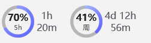
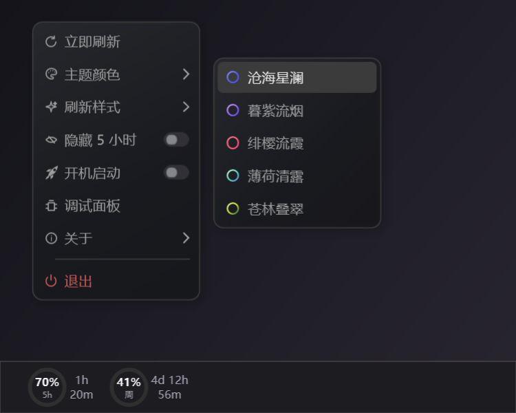
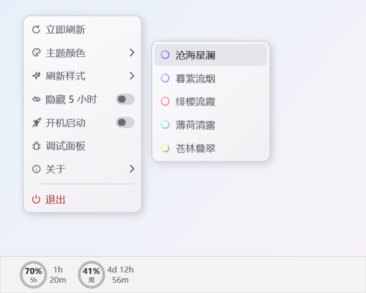

# CodexUsageBar

<p align="center">
  <a href="./README.md">中文</a> · <strong>English</strong>
</p>

<p align="center">
  A quiet Windows 11 taskbar overlay for Codex quota usage that follows the system appearance.
</p>

[](https://github.com/puwenfu/CodexUsageBar/actions/workflows/ci.yml)
[](https://github.com/puwenfu/CodexUsageBar/releases/latest)
[](https://github.com/puwenfu/CodexUsageBar/releases)
[](LICENSE)
[](https://www.microsoft.com/windows/windows-11)

**[Download the latest release](https://github.com/puwenfu/CodexUsageBar/releases/latest)**

> Unofficial community project. Not affiliated with or endorsed by OpenAI.

## Theme previews

These images are deterministic renders of the real WPF widget at 150% DPI with
sample values, not live Windows Shell screenshots. All five meter themes include
matching light variants and switch live with the Windows system appearance.
Reset times use the current remaining-duration format, such as `4d 12h 56m`.

<table>
  <tr>
    <td align="center">
      
    </td>
    <td align="center">
      
    </td>
  </tr>
  <tr>
    <td align="center">
      
    </td>
    <td align="center">
      
    </td>
  </tr>
  <tr>
    <td align="center">
      
    </td>
    <td align="center">
      
    </td>
  </tr>
</table>

## Interface preview

Right-click the taskbar widget to open its settings. The main menu and the
Theme Color submenu follow the Windows light or dark system appearance.

<table>
  <tr>
    <td align="center">
      
      <br><strong>Dark appearance</strong>
    </td>
    <td align="center">
      
      <br><strong>Light appearance</strong>
    </td>
  </tr>
</table>

## Features

- Shows remaining five-hour and weekly Codex allowance with reset countdowns.
- Uses two compact meters inside the primary Windows 11 taskbar.
- Refreshes on demand without taking focus or blocking nearby taskbar controls.
- Keeps the last safe values visible when Codex is temporarily unavailable.
- Runs as a self-contained executable without storing Codex credentials.
- Follows the Windows light or dark system appearance without requiring a restart.
- Includes five meter themes with matching light palettes and multiple refresh animations.

## Requirements

- Windows 11 with the primary taskbar at the bottom.
- A supported display layout with space at the left side of the primary taskbar.
- The Codex App or Codex CLI installed and signed in locally.

## Download and run

Download the current Windows ZIP from [GitHub Releases](https://github.com/puwenfu/CodexUsageBar/releases/latest), extract it, and run `CodexUsageBar.exe`.

The EXE is unsigned. Windows may show an unknown publisher warning or
SmartScreen prompt before the first run. Review the release and checksum before
choosing whether to continue.

## Verify the download

Each release includes `SHA256SUMS.txt`. In PowerShell, calculate the ZIP hash:

```powershell
Get-FileHash .\CodexUsageBar_*_win-x64.zip -Algorithm SHA256
```

Compare the displayed SHA-256 value with the ZIP entry in `SHA256SUMS.txt`.

## Usage

Left-click the widget to refresh. Right-click it to refresh, change the meter
theme or refresh animation, control the optional startup entry, open the debug
panel, or exit. Light and dark appearance is controlled automatically by
Windows; startup is disabled by default.

## Privacy

The widget reads quota data through the local Codex app-server protocol and
identifies itself with the current CodexUsageBar application version. It does
not copy or persist credentials, account identifiers, raw quota responses, or
task content. See [Privacy](docs/privacy.md) for details.

## Known limitations

The widget supports the primary bottom Windows 11 taskbar. It exits instead of
drawing elsewhere when the required taskbar is hidden, unavailable, or not
supported. Codex protocol changes or temporary connectivity failures can delay
refreshing; the last safe values remain visible when available.

## Build from source

Install the .NET 8 SDK, then run:

```powershell
dotnet restore CodexUsageBar.sln
dotnet build CodexUsageBar.sln --configuration Release --no-restore
```

For a local interactive launch, run `run.bat` from the repository root.

## Test

```powershell
dotnet test CodexUsageBar.sln --configuration Release --no-build --verbosity minimal
powershell -NoProfile -Command "Invoke-Pester -Path '.\tests\PublishSupport.Tests.ps1'"
powershell -NoProfile -Command "Invoke-Pester -Path '.\tests\PublishScript.Tests.ps1'"
```

## Release process

Only run local packaging when it has been explicitly approved:

```powershell
powershell -ExecutionPolicy Bypass -File .\scripts\publish.ps1
```

To validate release inputs without publishing:

```powershell
powershell -ExecutionPolicy Bypass -File .\scripts\publish.ps1 -WhatIfValidation
```

The version is maintained only in `Directory.Build.props`. Validation stops
before building if that version does not match the newest released entry in
`CHANGELOG.md`.

The release ZIP contains the standalone EXE, `README.md`, `CHANGELOG.md`,
`LICENSE`, and `THIRD-PARTY-NOTICES.txt`, with hashes in `SHA256SUMS.txt`. See
[Release process](docs/release.md) for the immutable release rules and final EXE
acceptance steps.

## Contributing

See [CONTRIBUTING.md](CONTRIBUTING.md).

## Security

See [SECURITY.md](SECURITY.md). Do not put credentials, account information, raw
Codex data, logs, or unredacted screenshots in public reports.

## License

CodexUsageBar is available under the [MIT License](LICENSE). Third-party runtime
notices are in [THIRD-PARTY-NOTICES.txt](THIRD-PARTY-NOTICES.txt).
